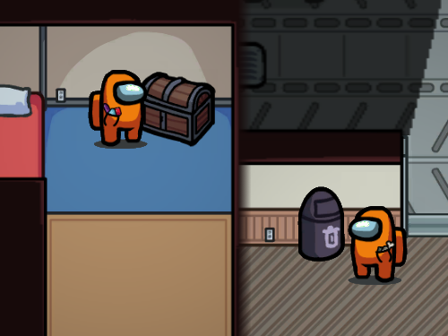
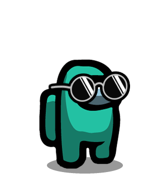
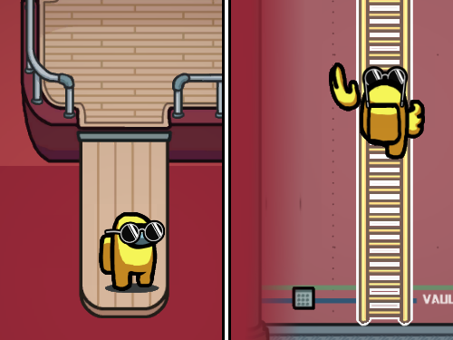
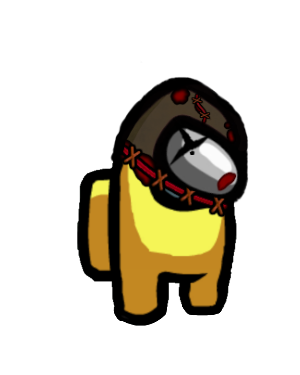
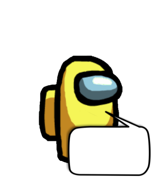
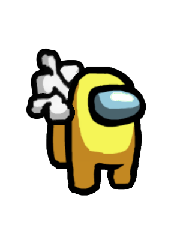

# TheOtherHats

Custom Hats for the [Among Us](https://innersloth.com/gameAmongUs.php) Mod *[The Other Roles](https://github.com/Eisbison/TheOtherRoles)*

## Table of Contents

[**Releases**](#releases)   
[**Custom Hats**](#custom-hats)    
&emsp;[Pockets](#pockets)    
&emsp;[Camera](#camera)    
&emsp;[Sunglasses](#sunglasses)    
&emsp;[DonutLover](#donutlover)    
&emsp;[Press](#press)    
&emsp;[Jetpack](#jetpack)    
&emsp;[Megaphone](#megaphone)    
&emsp;[Stitched Head](#stitched-head)    
&emsp;[Speech Bubble](#speech-bubble)    
&emsp;[Bones](#bones)    
[**About**](#about)    
&emsp;[Instructions](#instructions)    

## Releases

&emsp; *N/A*

## Custom Hats

*CustomHats* that are marked with "♦" are available to play in [*TheOtherRoles*](https://github.com/Eisbison/TheOtherRoles).

### Pockets

:arrow_down_small: ​[Download](resources/hats/pockets)

|                                   |                                   |
| --------------------------------- | --------------------------------- |
|  |  |

### Camera

:arrow_down_small: ​[Download](resources/hats/camera)

|                                   |                                   |
| --------------------------------- | --------------------------------- |
|  |  |

### Sunglasses

:arrow_down_small: ​[Download](resources/hats/sunglasses)

|                                   |                                   |
| --------------------------------- | --------------------------------- |
|  |  |

### DonutLover ♦

:arrow_down_small: ​[Download](resources/hats/DonutLover)

|                                   |                                   |
| --------------------------------- | --------------------------------- |
|  |  |

### Press ♦

:arrow_down_small: ​[Download](resources/hats/press)

|                                   |                                   |
| --------------------------------- | --------------------------------- |
|  |  |

### Jetpack ♦

:arrow_down_small: ​[Download](resources/hats/jetpack)

|                                     |                                     |
| ----------------------------------- | ----------------------------------- |
|  |  |

### Megaphone ♦

:arrow_down_small: ​[Download](resources/hats/megaphone)

|                                       |                                       |
| ------------------------------------- | ------------------------------------- |
|  |  |

### Stitched Head

:arrow_down_small: [Download](resources/hats/stitched)

|                                      |                                               |
| ------------------------------------ | --------------------------------------------- |
|  |   |

### Speech Bubble

:arrow_down_small: [Download (empty bubble)](resources/hats/bubble/bubble-empty_bounce.png)

|                                          |                                        |
| ---------------------------------------- | -------------------------------------- |
|  |  |

### Bones

:arrow_down_small: [Download](resources/hats/bones)

|                                   |                                   |
| --------------------------------- | --------------------------------- |
|  |  |

## About

:arrow_forward: [*TheOtherHats*](https://github.com/Eisbison/TheOtherRoles#custom-hats) by [**Eisbison**](https://github.com/Eisbison)

### Instructions

> - **Creation:** A hat consists of up to three textures. The aspect ratio of the textures has to be `4:5`, we recommend `300px:375px`:
>   - `Main texture (required)`:
>     - This is the main texture of your hat. It will usually be rendered in front of the player, if you set the `behind` parameter it will be rendered behind the player.
>     - The name of the texture needs to follow the pattern *hatname.png*, but you can also set some additional parameters in the file name by adding `_parametername` to the file name (before the *.png*).
>     - Parameter `bounce`: This parameter determines whether the hat will bounce while you're walking or not.
>     - Parameter `adaptive`: If this parameter is set, the Among Us coloring shader will be applied (the shader that replaces some colors with the colors that your character is wearing in the game). The color red (#ff0000) will be replaced with the primary color of your player and the color blue (#0000ff) with the secondary color. Also other colors will be affected and changed, you can have a look at the texture of the [Crewmate Hat](https://static.wikia.nocookie.net/among-us-wiki/images/e/e0/Crewmate_hat.png) to see how this feature should be used.
>     - Parameter `behind`: If this parameter is set, the main texture will be rendered behind the player.
>   - `Flipped texture (optional)`:
>     - This texture will be rendered instead of the Main texture, when facing the left.
>     - The name of the texture needs to follow the pattern `hatname_flip.png`.
>   - `Back texture (optional)`:
>     - This texture will be rendered behind the player.
>     - The name of the texture needs to follow the pattern `hatname_back.png`.
>   - `Flipped Back texture (optional)`:
>     - This texture will be rendered instead of the Back texture, when facing the left.
>     - The name of the texture needs to follow the pattern `hatname_back_flip.png`.
>   - `Climb texture (optional)`:
>     - This texture will be rendered in front of the player, when he's climbing.
>     - The name of the texture needs to follow the pattern `hatname_climb.png`.
> - **Testing:** You can test your hat design by putting all the files in the `\TheOtherHats\Test` subfolder of your mod folder. Then whenever you start a freeplay game, you and all the dummies will be wearing the new hat. You don't need to restart Among Us if you change the hat files, just exit and reenter the freeplay mode.
>
> - **Submission:** If you got a hat design, you can submit it on our [Discord server](https://discord.gg/77RkMJHWsM). We'll look at all the hats and add all the good ones to the game.